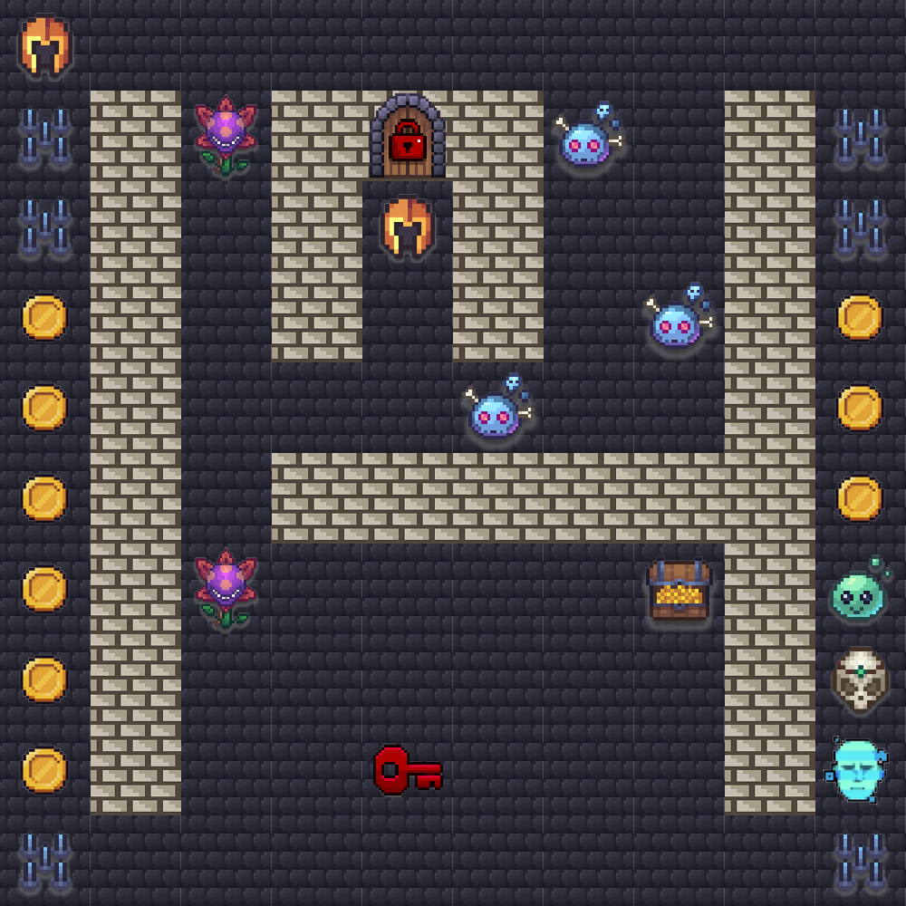
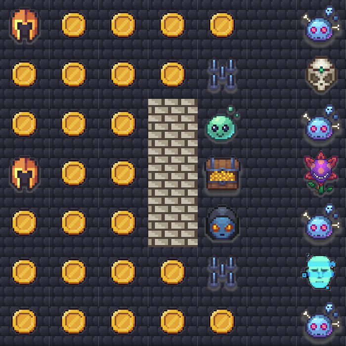
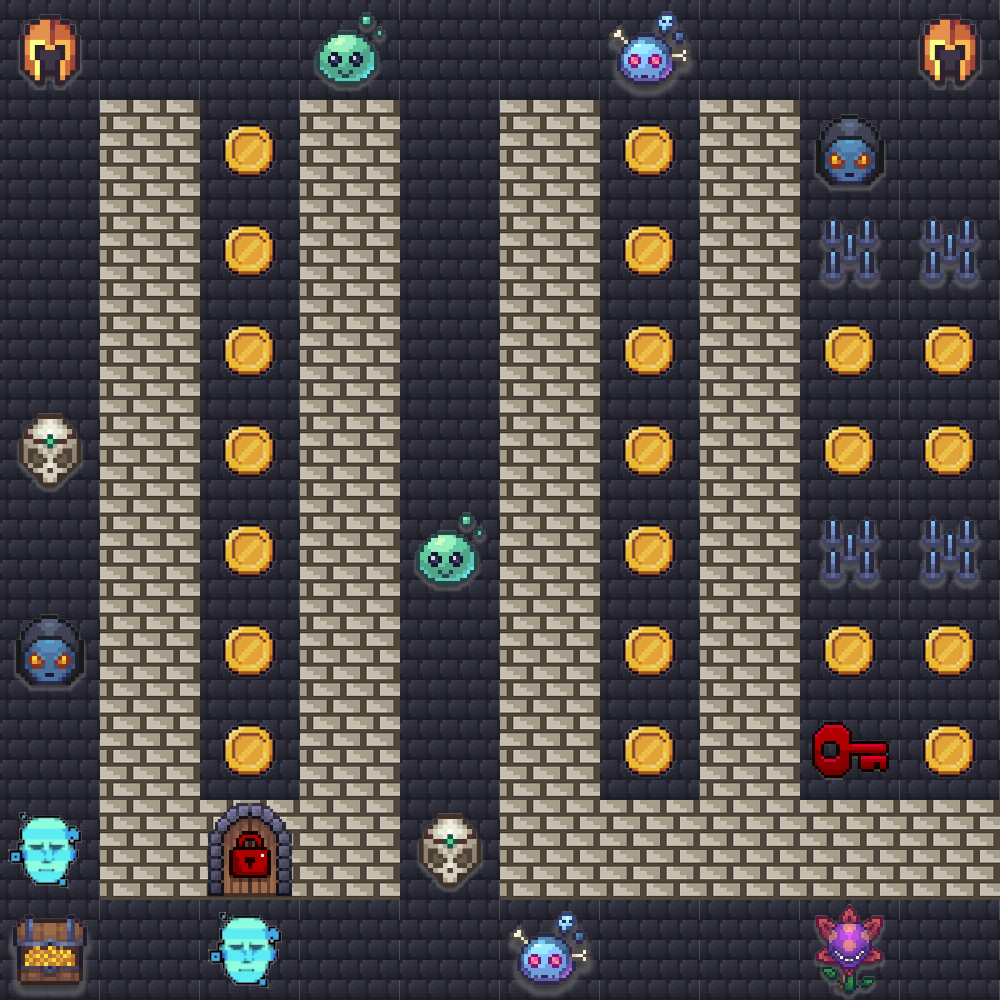

# EMEA Virtual — Agentic Challenge 2026

## Event Details

- **Event**: AWS AI League — EMEA Virtual (Europe, Middle East & Africa)
- **Date**: September 2026
- **Format**: 1 known map (practice / Round 1) + 3 unknown maps (finale rounds)
- **Note**: Lambda code, agent setup, and system prompt cannot change between rounds — only the navigation prompt text changes.
- **Relationship to Virtual APJ**: The EMEA Round 1 map is identical to the [Virtual APJ](../Virtual-APJ/) Round 1 map, and the finale maps are close variants of the APJ finales with repositioned start/treasure/door tiles and reduced starting lives.

## Game Parameters (Round 1 / Practice)

| Parameter | Value |
|-----------|-------|
| Grid Size | 9×9 |
| Starting Lives | 5 |
| Timer | 300 seconds (5:00) |
| Start Position | E6 (row 5, col 4) |
| Treasure | I5 (row 4, col 8) |

## Practice Map


## Challenge Types

| Tile | Name | Points (R1) | Grading Method |
|------|------|-------------|----------------|
| c1 | Guardrail (safety refusal) | 400 | guardrail_block |
| c2 | Schedule Sage (section review) | 750 | json_exact_match |
| c3 | Claims Creature (FHIR EOB) | 750 | json_exact_match |
| c4 | Web Weaver (registry lookup) | 750 | contains_match |
| c5 | Bonehead (simple Q&A) | 250 | contains_match |
| c18 | Permit Pro (energy calc) | 600 | json_exact_match |

## Door & Key Tiles

A key must be collected before its matching door can be opened. Passing a door without the key costs -5 lives.

| Tile | Name | Points (R1) | Damage without key |
|------|------|-------------|--------------------|
| c30 | Red Door | 1000 | -5 lives |
| c40 | Red Key | 50 | — |

## Other Tiles

| Tile | Name | Effect |
|------|------|--------|
| c7 | Coins | +2500 points (R1) |
| c8 | Spike Trap | -1 life |
| wall | Wall | Impassable |
| normal | Normal | Walkable, no effect |
| treasure | Treasure | Game objective (+3000 bonus) |

## Scoring Formula

```
Final Score = challenge_points + coin_points + treasure_bonus + lives_bonus + token_bonus
```

- **Treasure Reached**: +3000 points
- **Per Life Remaining**: +250 points
- **Token Bonus**: max(0, 1000 - (total_output_tokens / challenges_visited))

The practical maximum core (all challenges correct, treasure, lives remaining after the mandatory spike traps) is **18,100** before token bonus on Round 1. Ranking among perfect-core runs is decided almost entirely by the token bonus.

---

## Finale Maps

The 3 finale maps were revealed during the live event. Agents used the same Lambda code and system prompt across all rounds — only the navigation prompt changed. Each finale round overrides the tile point values (same overrides as the corresponding Virtual APJ finale). EMEA reduced the starting lives in the later finale rounds (see below).

### Finale 1 — Speed Run (10×10, 45s)

| Parameter | Value |
|-----------|-------|
| Grid Size | 10×10 |
| Timer | 45 seconds |
| Start Position | E3 (row 2, col 4) |
| Treasure | H7 (row 6, col 7) |
| Point Overrides | c5: 350, c7: 175, c1: 400, c3: 750, c4: 750, c18: 600, c40: 50, c30: 3000 (-5) |



APJ Finale 1 variant. The red door (c30) is moved up to E2 with the start directly below at E3, the E4 wall opens to a normal tile, the treasure is relocated from the bottom edge to H7, and the two Guardrail (c1) tiles shift to the C column (C2, C7).

### Finale 2 — Coin Vault (7×7, 75s)

| Parameter | Value |
|-----------|-------|
| Grid Size | 7×7 |
| Starting Lives | 2 |
| Timer | 75 seconds |
| Start Position | A4 (row 3, col 0) |
| Treasure | E4 (row 3, col 4) |
| Point Overrides | c7: 25, c5: 500, c1: 1000, c2: 1500, c3: 1500, c4: 1500, c18: 1500 |



APJ Finale 2 variant. The start/treasure/challenge line is shifted left: start at A4 (in the coin block), treasure at E4, and the Guardrail (c1) moved to G4 on the right edge. Only **2 starting lives**, making the spike traps and door far more punishing.

### Finale 3 — Comb Maze (10×10, 150s)

| Parameter | Value |
|-----------|-------|
| Grid Size | 10×10 |
| Starting Lives | 4 |
| Timer | 150 seconds |
| Start Position | J1 (row 0, col 9) |
| Treasure | A10 (row 9, col 0) |
| Point Overrides | c5: 250, c7: 250, c1: 400, c2: 750, c3: 750, c4: 750, c18: 600, c40: 50, c30: 1000 (-5) |



APJ Finale 3 variant. Start and treasure are mirrored to the opposite corners (start J1, treasure A10), the Red Key (c40) is moved to I8 with a coin (c7) taking its old G8 spot, and the round runs with **4 starting lives**.

---

## Results

Round 1 (online leaderboard) determined finale qualification. **Several of the top raw-leaderboard finishers were disqualified from the finale** (Tim, Simon, Yuki Tsunoda), so the finale field was filled by the next qualifiers.

### Round 1 Leaderboard (top finishers)

| Rank | Competitor | Score | Tokens | Finale |
|------|-----------|-------|--------|--------|
| 1 | Tim | 19030 | 1326 | Disqualified |
| 2 | MarkRoss | 19030 | 1327 | Qualified |
| 3 | Simon | 19030 | 1330 | Disqualified |
| 4 | Yuki Tsunoda | 19023 | 1455 | Disqualified |
| 5 | Jochem | 19019 | 1539 | Qualified |
| 6 | Edward | 19018 | 1554 | Qualified |

(MarkRoss, Jochem, and Edward advanced to the finale due to the disqualifications above.)

### Finale Results (sum of the 3 finale rounds)

| Rank | Competitor | Finale 1 | Finale 2 | Finale 3 | Total |
|------|-----------|----------|----------|----------|-------|
| 🥇 1 | MarkRoss | 7333 | 8401 | 12207 | **27941** |
| 🥈 2 | Edward | 3983 | 3564 | 7689 | **15236** |
| 🥉 3 | Jochem | 2250 | 2464 | 5300 | **10014** |

**Winner: MarkRoss (27,941)**, leading every finale round. Notably, Edward's model ran with **default prompts** — his wife went into labour an hour before the finale — yet it still finished 2nd, ahead of Jochem.

---

## Files

- `map.json` — Known practice / Round 1 map (9×9, identical to Virtual APJ R1)
- `map.png` — Visual rendering of practice map
- `finale-1-map.json` / `finale-1-map.png` — Finale round 1 (10×10, 45s)
- `finale-2-map.json` / `finale-2-map.png` — Finale round 2 (7×7, 75s, 2 lives)
- `finale-3-map.json` / `finale-3-map.png` — Finale round 3 (10×10, 150s, 4 lives)
