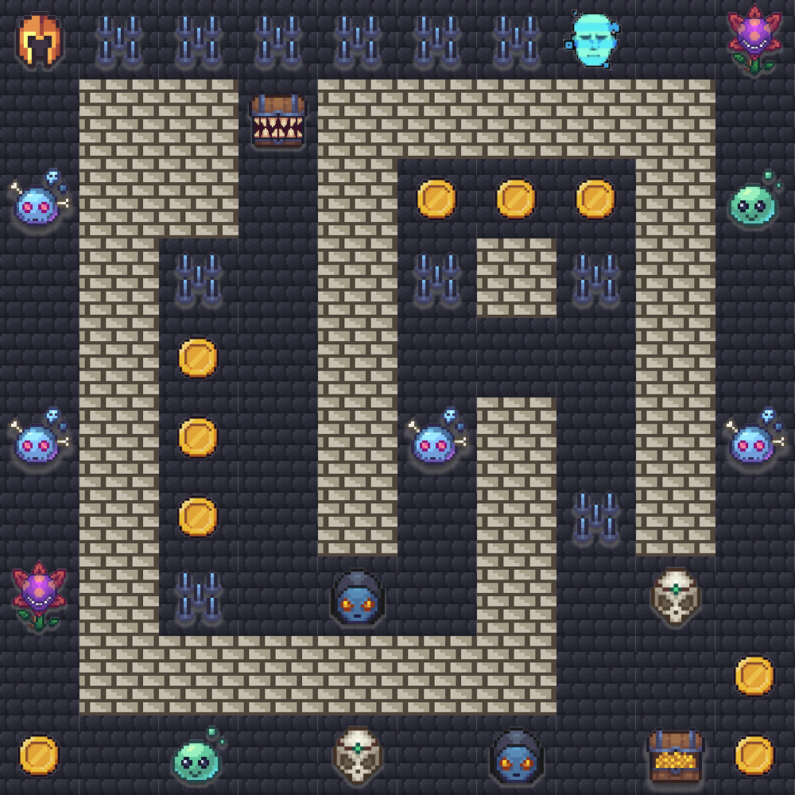

# Hero Community Builder — Agentic Challenge 2026

## Event Details

- **Event**: AWS AI League — Hero Community Builder
- **Date**: May 2026
- **Format**: Online competition, single known map, leaderboard-based ranking

## Game Parameters

| Parameter | Value |
|-----------|-------|
| Grid Size | 10×10 |
| Starting Lives | 5 |
| Timer | 230 seconds (3:50) |
| Start Position | A1 (top-left, [0,0]) |
| Treasure | I9 (row 8, col 8) |

## Map



## Challenge Types

| Tile | Name | Points | Grading Method |
|------|------|--------|----------------|
| c1 | Violent Violet (Guardrail) | 400 | guardrail_block |
| c2 | Blue Brain (Code Execution) | 600 | code_execution |
| c3 | Memento (Memory) | 550 | exact_match |
| c4 | Dark Prophet (Web Scraping) | 800 | web_content_match |
| c5 | Bonehead (Simple Q&A) | 250 | contains_match |
| c17 | Distraction (Concise Answer) | 750 | llm_judge |
| c18 | Healthcare API (Structured Output) | 500 | json_exact_match |

## Other Tiles

| Tile | Name | Effect |
|------|------|--------|
| c7 | Coins | +250 points |
| c8 | Spike Trap | -1 life |
| wall | Wall | Impassable |
| normal | Normal | Walkable, no effect |
| treasure | Treasure | Game objective (+1000 bonus) |

## Scoring Formula

```
Final Score = challenge_points + coin_points + treasure_bonus + lives_bonus + token_bonus
```

- **Treasure Reached**: +1000 points
- **Per Life Remaining**: +250 points
- **Token Bonus**: max(0, 1000 - (total_output_tokens / challenges_visited))

## Custom Model Bonus

Fine-tuned models registered on sub-agents reduce the token penalty:

| Custom Models | Token Penalty Reduction |
|---------------|------------------------|
| 1 | 50% |
| 2 | 70% |
| 3 | 85% |
| 4 | 92% |
| 5 | 95% |

## Files

- `map.json` — The competition map as a 10×10 grid array
- `map.png` — Visual rendering of the map
