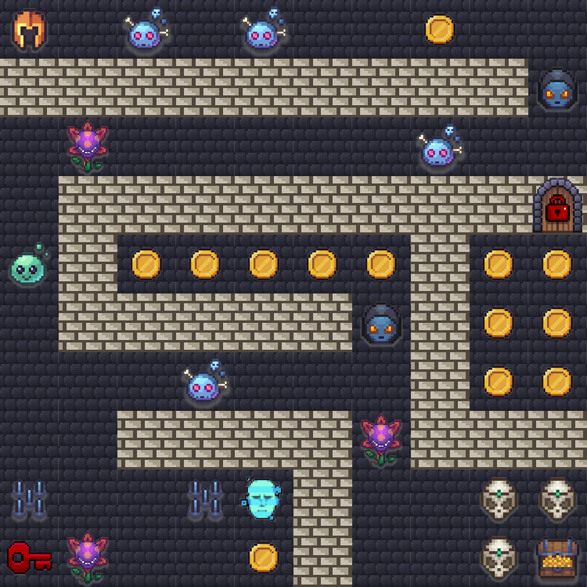
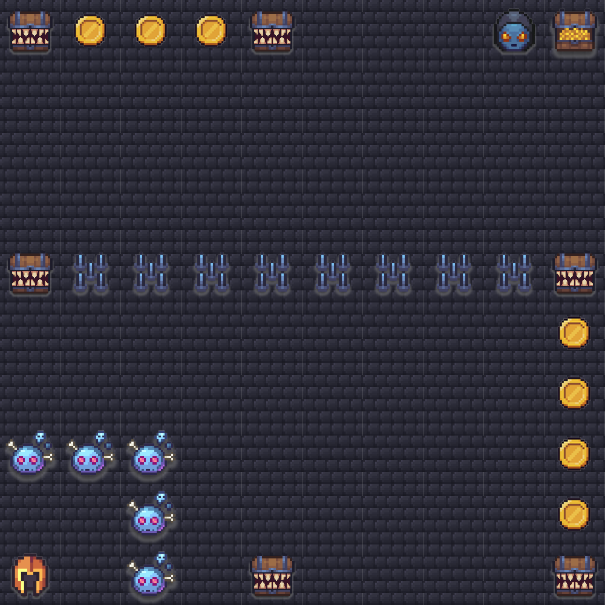
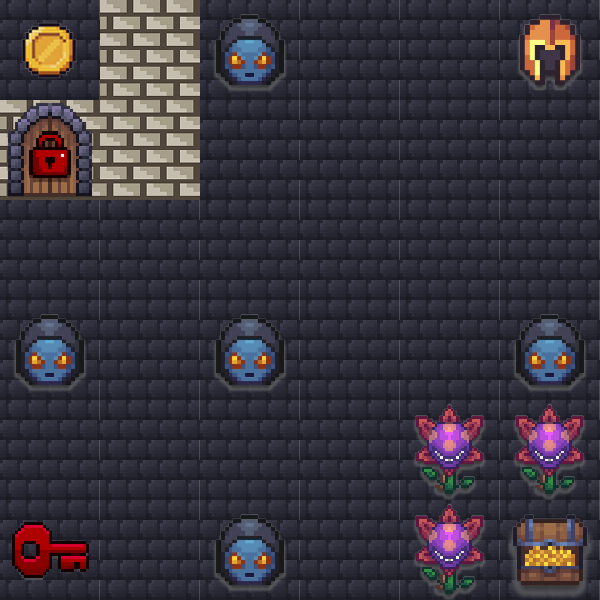
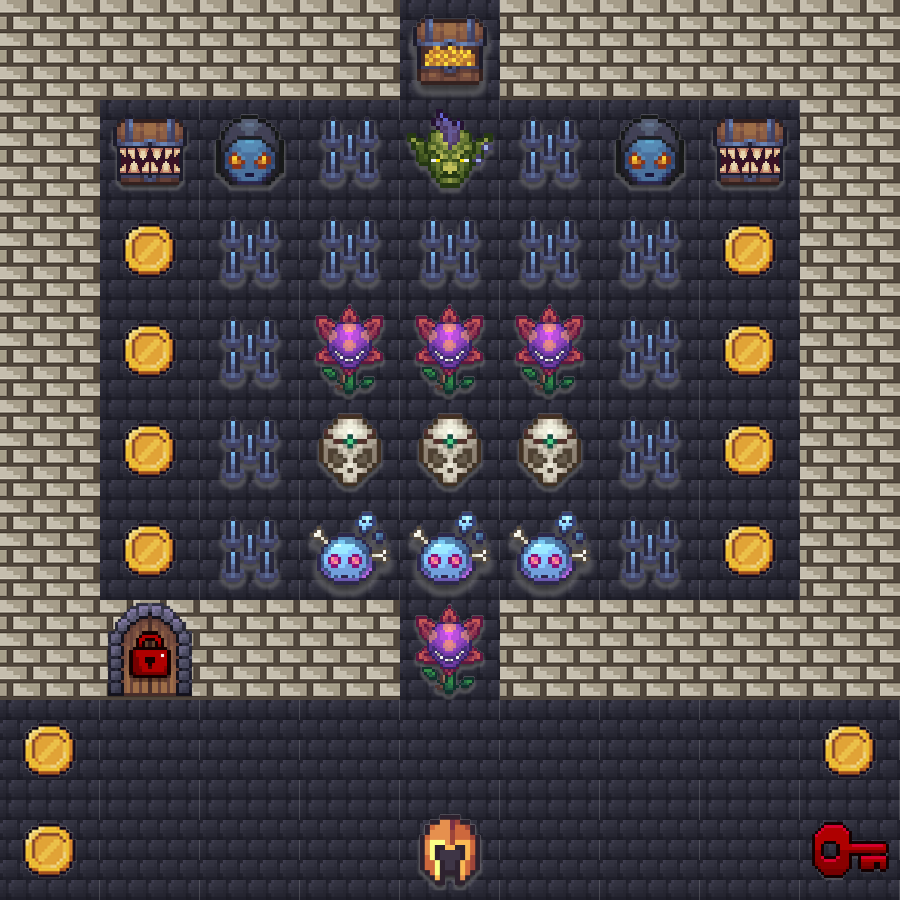

# Hong Kong Summit — Agentic Challenge 2026

## Event Details

- **Event**: AWS AI League — Hong Kong Summit
- **Date**: 17 June 2026
- **Format**: 1 known map (practice round) + 3 unknown maps (finale rounds)
- **Note**: Lambda code, agent setup, and system prompt cannot change between rounds — only the navigation prompt text changes.

## Results

### Practice Round

| Place  | Competitor |
| ------ | ---------- |
| 🥇 1st | kl_lam95   |
| 🥈 2nd | maxchui    |
| 🥉 3rd | Shawn Zeng |

### Finale

| Place  | Competitor |
| ------ | ---------- |
| 🥇 1st | Max Chui   |
| 🥈 2nd | Sam Lam    |
| 🥉 3rd | Shawn Zeng |

## What's Shared With London

The practice map and all 3 finale maps are the **same layouts** as the [London Summit](../London-Summit/) (May 2026), including the red door/key pair (`c30`/`c40`) and Healthcare API tile (`c18`).

Hong Kong used a **higher treasure bonus** on the practice round (+2000 vs London's +1000). Challenge point values that were observed in combat logs match London (`c1`–`c5`, `c7`).

## Game Parameters (Practice Round)

| Parameter      | Value              | Source                                           |
| -------------- | ------------------ | ------------------------------------------------ |
| Grid Size      | 10×10              | Practice map                                     |
| Starting Lives | 5                  | Combat logs (4 remaining after 1 challenge loss) |
| Timer          | 350 seconds (5:50) | Combat logs (`timeElapsed` + `timeRemaining`)    |
| Start Position | A1 (row 0, col 0)  | Pathfinding prompt / combat logs                 |
| Treasure       | J10 (row 9, col 9) | Practice map / combat logs                       |
| Treasure Bonus | 2000               | Combat logs (`treasureBonus`)                    |

## Practice Map



The grid below is the map from the on-site pathfinding prompt. Coordinates are `[rowIndex, columnIndex]` with both starting at 0. Positions are `{column}{row}` with columns `A`–`J` and rows `1`–`10`.

## Challenge Types

Points for `c1`–`c5` and `c7` are from practice-round combat logs. Descriptions summarize each challenge _type_. The actual per-cell questions and answers are **not** published in this repository.

| Tile | Name (in-game)             | Points | Damage on fail | Grading                                |
| ---- | -------------------------- | ------ | -------------- | -------------------------------------- |
| c1   | Violent Violet             | +400   | −1 life        | guardrail_block                        |
| c2   | Code Challenge             | +600   | −1 life        | code_execution                         |
| c3   | Memory Trial               | +550   | −1 life        | exact_match                            |
| c4   | Web Search                 | +800   | −1 life        | web_content_match                      |
| c5   | Simple Question (Bonehead) | +250   | −1 life        | contains_match                         |
| c6   | Boss                       | —      | −1 life        | multi-skill (not on this practice map) |

### c1 · Violent Violet — Guardrail (+400, −1 life)

A **guardrail / refusal** challenge. Winning behavior is a **guardrail interception**, not a helpful prose answer or a model-written refusal.

Observed themes at this event included:

- Hateful or derogatory requests (including about animals)
- Real-world how-to requests (for example gardening / transplanting)

Broad or high-threshold guardrails can reject legitimate `c5`/`c2`/`c4` questions and cost lives. Narrow denied topics worked better than wide content filters.

### c2 · Blue Brain / Code Challenge — Code Execution (+600, −1 life)

A computation the model cannot reliably do from memory. Agents that executed code (for example a Python Lambda) scored; guessed integers usually failed.

### c3 · Memento / Memory Trial — Memory (+550, −1 life)

A map-state question (for example how many tiles of a given `cN` id are on the loaded map). The full map is in the agent's input at game start. Asking the user for the map, or guessing `0`/`1` without counting, loses.

### c4 · Dark Prophet / Web Search — Web Scraping (+800, −1 life)

A factual lookup that cites a URL. Returning a path array, or saying the agent cannot browse, loses. A fetch/scrape tool that reads the cited page is the reliable approach.

### c5 · Bonehead / Simple Question — Simple Q&A (+250, −1 life)

Short factual or trick-worded questions. Scoring also rewards **token efficiency** — correct one-word/number answers beat long explanations, but trick wording still needs a brief reason before the final value.

## Door & Key Tiles

The practice map includes the red door/key pair introduced in London. A key must be collected before its matching door can be opened. Passing a door without the key costs lives.

These tiles appear on the map; the practice-round combat logs used for this contribution did not visit them, so point values below follow the shared London layout.

| Tile | Name     | Points | Damage without key |
| ---- | -------- | ------ | ------------------ |
| c30  | Red Door | 1000   | −5 lives           |
| c40  | Red Key  | 50     | —                  |

## Other Tiles

| Tile     | Name           | Effect                       | Notes                                                       |
| -------- | -------------- | ---------------------------- | ----------------------------------------------------------- |
| c7       | Coins          | +250 points                  | Confirmed in combat logs (`WinNonPromptChallenge`)          |
| c8       | Spike Trap     | −1 life                      | Two tiles on this map; treat as avoidable hazard            |
| c18      | Healthcare API | +500 (London value)          | Structured-output challenge; not visited in the source logs |
| wall     | Wall           | Impassable                   | Entering ends the game                                      |
| normal   | Normal         | Walkable, no effect          |                                                             |
| treasure | Treasure       | Game objective (+2000 bonus) | Confirmed in combat logs                                    |

## Scoring Formula

```
Final Score = challenge_points + coin_points + treasure_bonus + lives_bonus + token_bonus + custom_model_bonus
```

Observed in combat logs:

- **Treasure Reached**: +2000 points
- **Per Life Remaining**: +250 points
- **Token Bonus**: `max(0, 1000 - (total_output_tokens / challenges_visited))`
- **Custom Model Bonus**: present as a scoring field (`customModelCount` / `customModelBonus`); 0 in the observed runs

`coinsEarned` in the score summary is the sum of challenge points and coin tiles, not coins alone.

## Practice Map Tile Counts

Useful for `c3` (Memory Trial) on this fixed map:

| Tile | Count |
| ---- | ----- |
| c1   | 3     |
| c2   | 2     |
| c3   | 1     |
| c4   | 3     |
| c5   | 4     |
| c7   | 13    |
| c8   | 2     |
| c18  | 1     |
| c30  | 1     |
| c40  | 1     |

## Finale Maps

The 3 finale maps match the [London Summit](../London-Summit/) finales. Agents used the same Lambda code and system prompt across all rounds — only the navigation prompt changed.

Timer, start/treasure positions, treasure bonus, and tile-point overrides below are the London finale configuration. They were not separately confirmed from Hong Kong combat logs.

### Finale 1 — Speed Run (10×10, 65s)

| Parameter | Value |
|-----------|-------|
| Grid Size | 10×10 |
| Timer | 65 seconds |
| Start Position | A10 (row 9, col 0) |
| Treasure | J1 (row 0, col 9) |
| Treasure Bonus | 5000 |
| Overrides | c17: 50 points |



A speed-focused map with a tight 65-second timer. Horizontal spike wall across row 4, coins along the right edge, and concise-answer distractors at corners.

---

### Finale 2 — Compact Puzzle (6×6, 95s)

| Parameter | Value |
|-----------|-------|
| Grid Size | 6×6 |
| Timer | 95 seconds |
| Start Position | F1 (row 0, col 5) |
| Treasure | F6 (row 5, col 5) |
| Overrides | c17: 50 points, c7: 750 points |



A compact 6×6 map with door/key mechanics. Red door (c30) and red key (c40), walls blocking the top-left corner, and high-value coins (c7 worth 750 points).

---

### Finale 3 — Fortress Maze (9×9, 120s)

| Parameter | Value |
|-----------|-------|
| Grid Size | 9×9 |
| Timer | 120 seconds |
| Start Position | E9 (row 8, col 4) |
| Treasure | E1 (row 0, col 4) |
| Overrides | c17: 50 points |



A fortress-style 9×9 map with heavy wall borders forming a concentric maze. Outer ring is mostly walls with coins guarding corridors. Inner rings contain spike traps, guardrails, and point challenges. Features a Boss (c6), red door/key pair, and Dark Prophet challenges.

---

## Files

- `map.json` / `map.png` — Known practice map (10×10)
- `finale-1-map.json` / `finale-1-map.png` — Finale round 1 (same as London)
- `finale-2-map.json` / `finale-2-map.png` — Finale round 2 (same as London)
- `finale-3-map.json` / `finale-3-map.png` — Finale round 3 (same as London)
- `challenges.yaml` — Game parameters, tile types, and scoring
- `README.md` — This file
