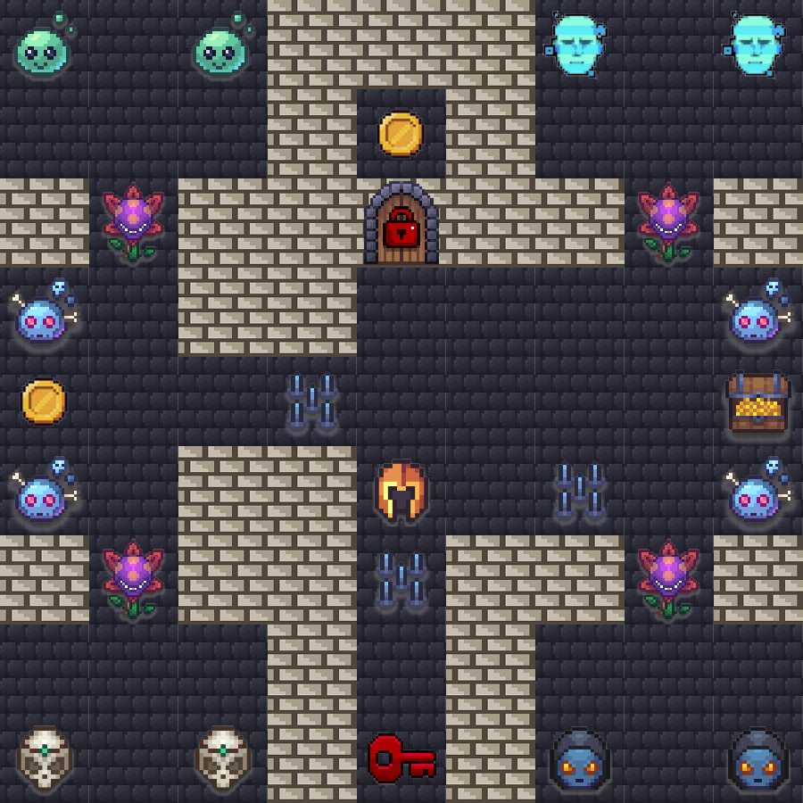
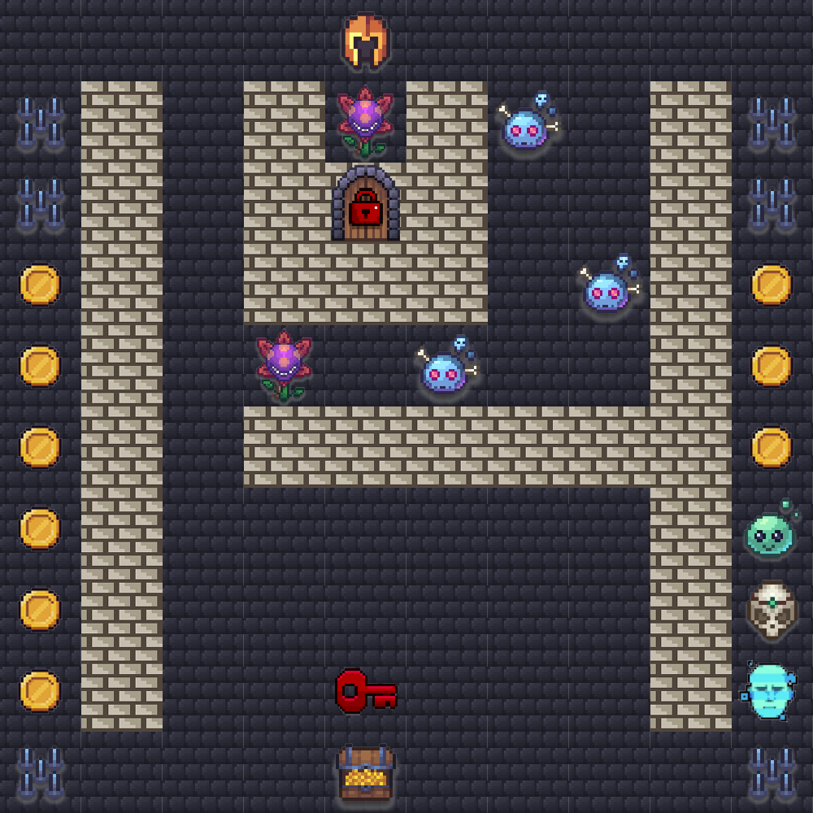
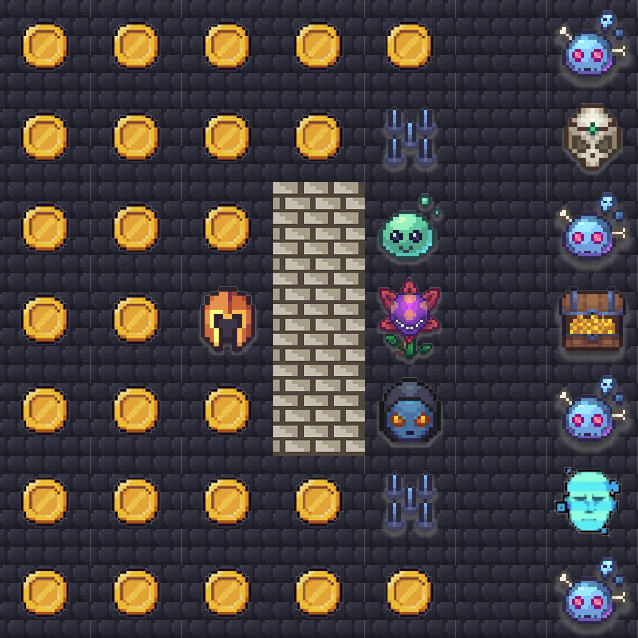
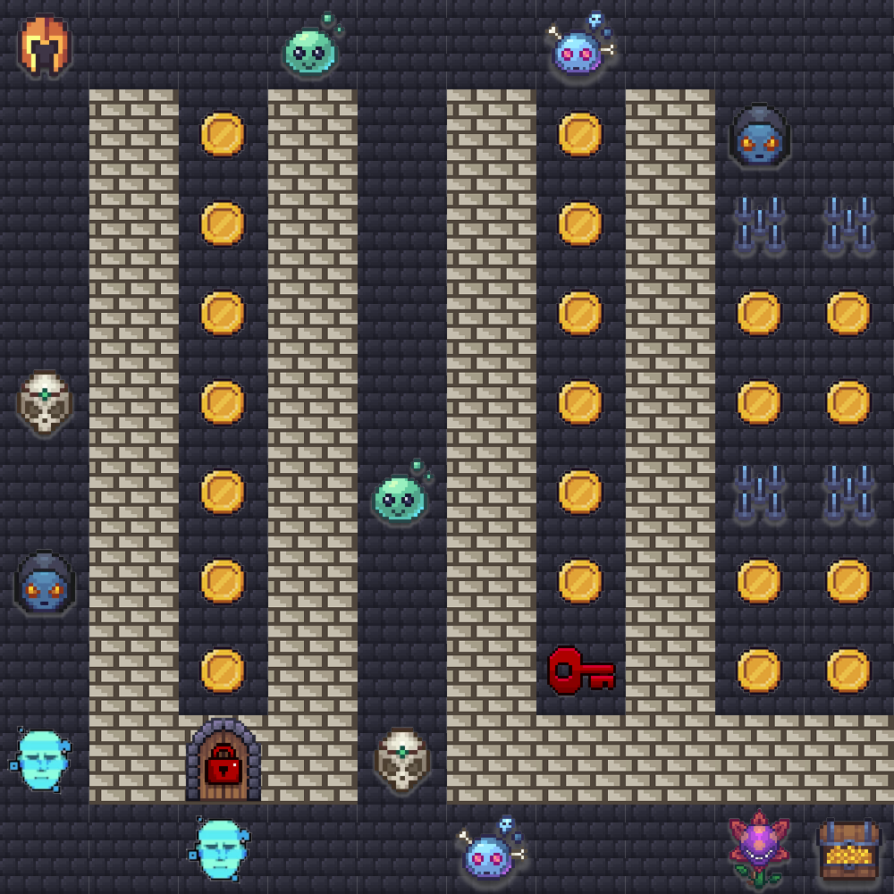

# LATAM Virtual — Agentic Challenge 2026

## Event Details

- **Event**: AWS AI League — LATAM Virtual (Latin America)
- **Date**: September 2026
- **Format**: 1 known map (practice / Round 1) + 3 unknown maps (finale rounds)
- **Note**: Lambda code, agent setup, and system prompt cannot change between rounds — only the navigation prompt text changes.
- **Maps**: All maps (R1 + 3 finales) are identical to the [Virtual APJ](../Virtual-APJ/) competition.

## Game Parameters (Round 1 / Practice)

| Parameter | Value |
|-----------|-------|
| Grid Size | 9×9 |
| Starting Lives | 5 |
| Timer | 300 seconds (5:00) |
| Start Position | E6 (row 5, col 4) |
| Treasure | I5 (row 4, col 8) |

## Practice Map



## Challenge Types

| Tile | Name | Points (R1) | Grading Method |
|------|------|-------------|----------------|
| c1 | Guardrail (safety refusal) | 400 | guardrail_block |
| c2 | Schedule Sage (section review) | 750 | json_exact_match |
| c3 | Claims Creature (FHIR EOB) | 750 | json_exact_match |
| c4 | Web Weaver (registry lookup) | 750 | contains_match |
| c5 | Bonehead (simple Q&A) | 250 | contains_match |
| c18 | Permit Pro (energy calc) | 600 | json_exact_match |

## Door & Key Tiles

A key must be collected before its matching door can be opened. Passing a door without the key costs -5 lives.

| Tile | Name | Points (R1) | Damage without key |
|------|------|-------------|--------------------|
| c30 | Red Door | 1000 | -5 lives |
| c40 | Red Key | 50 | — |

## Other Tiles

| Tile | Name | Effect |
|------|------|--------|
| c7 | Coins | +2500 points (R1) |
| c8 | Spike Trap | -1 life |
| wall | Wall | Impassable |
| normal | Normal | Walkable, no effect |
| treasure | Treasure | Game objective (+3000 bonus) |

## Scoring Formula

```
Final Score = challenge_points + coin_points + treasure_bonus + lives_bonus + token_bonus
```

- **Treasure Reached**: +3000 points
- **Per Life Remaining**: +250 points
- **Token Bonus**: max(0, 1000 - (total_output_tokens / challenges_visited))

---

## Finale Maps

The 3 finale maps were revealed during the live event. Agents used the same Lambda code and system prompt across all rounds — only the navigation prompt changed. Each finale round overrides the tile point values (same overrides as Virtual APJ). All three finale maps are identical to the Virtual APJ finales.

### Finale 1 — Speed Run (10×10, 45s)

| Parameter | Value |
|-----------|-------|
| Grid Size | 10×10 |
| Timer | 45 seconds |
| Start Position | E1 (row 0, col 4) |
| Treasure | E10 (row 9, col 4) |
| Point Overrides | c5: 350, c7: 175, c1: 400, c3: 750, c4: 750, c18: 600, c40: 50, c30: 3000 (-5) |



---

### Finale 2 — Coin Vault (7×7, 75s)

| Parameter | Value |
|-----------|-------|
| Grid Size | 7×7 |
| Timer | 75 seconds |
| Start Position | C4 (row 3, col 2) |
| Treasure | G4 (row 3, col 6) |
| Point Overrides | c7: 25, c5: 500, c1: 1000, c2: 1500, c3: 1500, c4: 1500, c18: 1500 |



---

### Finale 3 — Comb Maze (10×10, 150s)

| Parameter | Value |
|-----------|-------|
| Grid Size | 10×10 |
| Timer | 150 seconds |
| Start Position | A1 (row 0, col 0) |
| Treasure | J10 (row 9, col 9) |
| Point Overrides | c5: 250, c7: 250, c1: 400, c2: 750, c3: 750, c4: 750, c18: 600, c40: 50, c30: 1000 (-5) |



---

## Results

The three finalists were **wen**, **David Gantiva C**, and **ContardoRM**. (The full Round 1 leaderboard is not available for this event.)

### Finale Results (sum of the 3 finale rounds)

| Rank | Competitor | Finale 1 | Finale 2 | Finale 3 | Total |
|------|-----------|----------|----------|----------|-------|
| 🥇 1 | wen | 3263 | 7842 | 17763 | **28868** |
| 🥈 2 | David Gantiva C | 4578 | 10988 | 9325 | **24891** |
| 🥉 3 | ContardoRM | 2497 | 3879 | 1000 | **7376** |

**Winner: wen (28,868)**. wen trailed after the first two rounds but a dominant Finale 3 (17,763 — the highest single-round score of the finale) sealed the title. David Gantiva C led after Finale 2 (topping both F1 and F2) but a weaker Finale 3 dropped them to second.

---

## Files

- `map.json` — Known practice / Round 1 map (9×9, identical to Virtual APJ R1)
- `map.png` — Visual rendering of practice map
- `finale-1-map.json` / `finale-1-map.png` — Finale round 1 (10×10, 45s)
- `finale-2-map.json` / `finale-2-map.png` — Finale round 2 (7×7, 75s)
- `finale-3-map.json` / `finale-3-map.png` — Finale round 3 (10×10, 150s)
