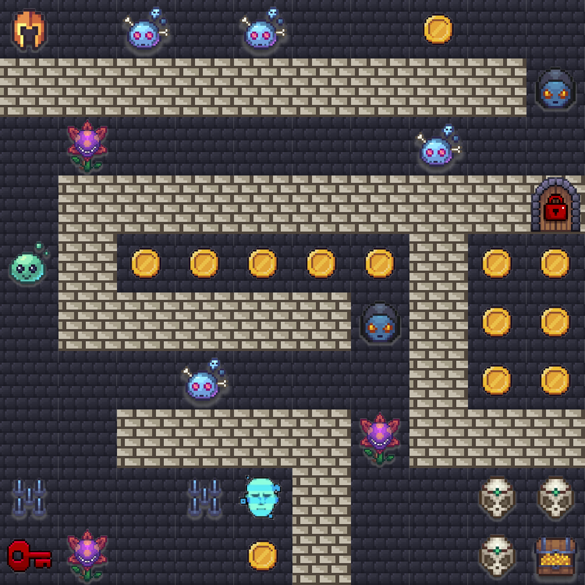
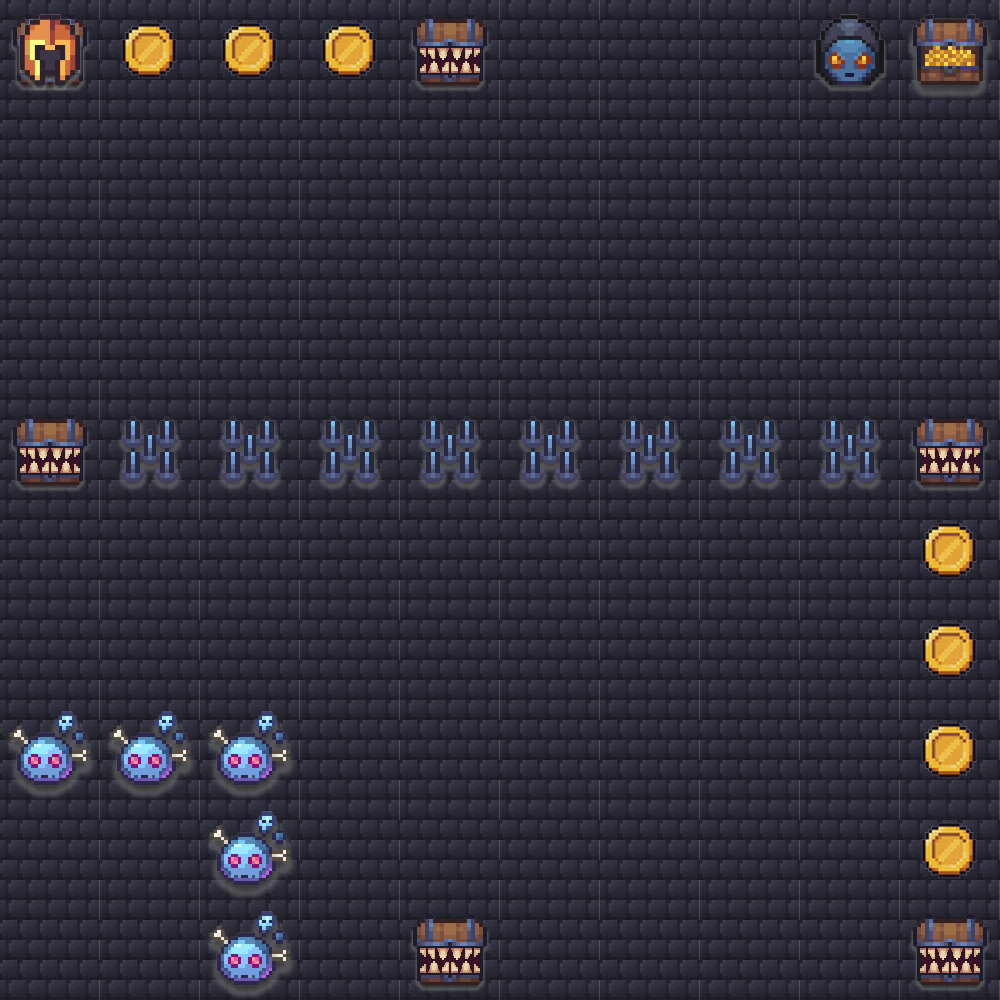
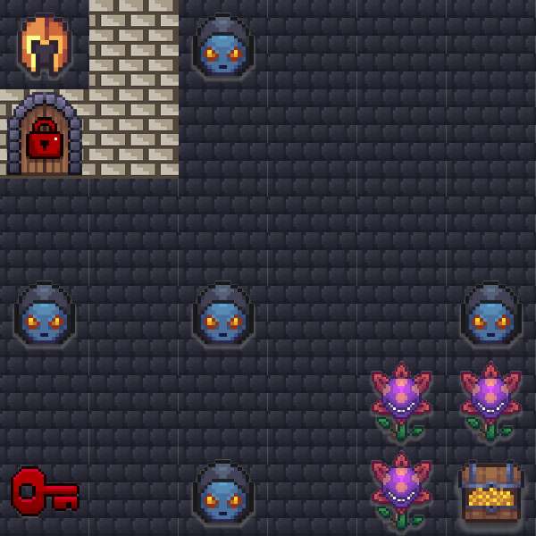
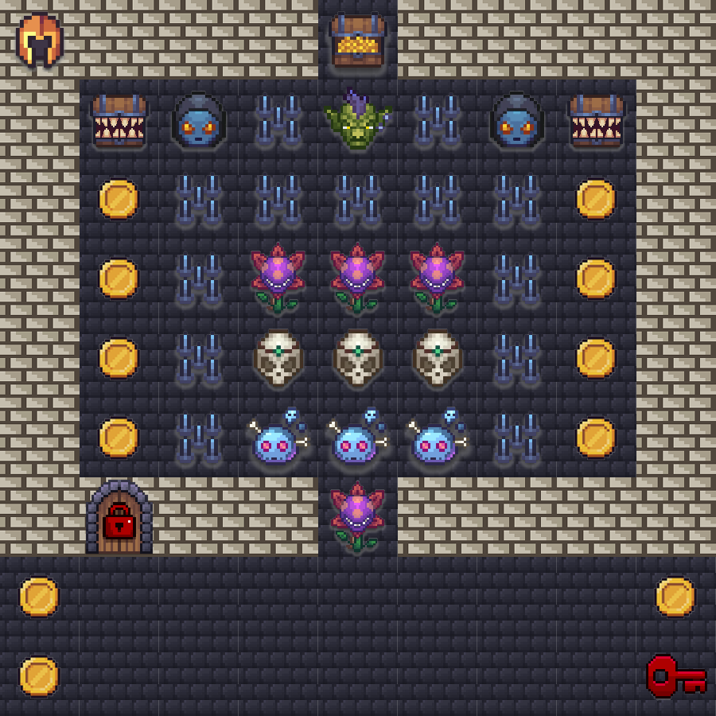

# London Summit — Agentic Challenge 2026

## Event Details

- **Event**: AWS AI League — London Summit
- **Date**: May 2026
- **Format**: 1 known map (practice round) + 3 unknown maps (finale rounds)
- **Note**: Lambda code, agent setup, and system prompt cannot change between rounds — only the navigation prompt text changes.

## Game Parameters (Practice Round)

| Parameter | Value |
|-----------|-------|
| Grid Size | 10×10 |
| Starting Lives | 5 |
| Timer | 350 seconds (5:50) |
| Start Position | A1 (row 0, col 0) |
| Treasure | J10 (row 9, col 9) |

## Practice Map



## Challenge Types

| Tile | Name | Points | Grading Method |
|------|------|--------|----------------|
| c1 | Violent Violet (Guardrail) | 400 | guardrail_block |
| c2 | Blue Brain (Code Execution) | 600 | code_execution |
| c3 | Memento (Memory) | 550 | exact_match |
| c4 | Dark Prophet (Web Scraping) | 800 | web_content_match |
| c5 | Bonehead (Simple Q&A) | 250 | contains_match |
| c17 | Distraction (Concise Answer) | 750 | llm_judge |
| c18 | Healthcare API (Structured Output) | 500 | json_exact_match |

## Door & Key Tiles

London introduced colored doors and keys. A key must be collected before its matching door can be opened. Passing a door without the key costs -5 lives.

| Tile | Name | Points | Damage without key |
|------|------|--------|--------------------|
| c30 | Red Door | 1000 | -5 lives |
| c40 | Red Key | 50 | — |

## Other Tiles

| Tile | Name | Effect |
|------|------|--------|
| c7 | Coins | +250 points |
| c8 | Spike Trap | -1 life |
| wall | Wall | Impassable |
| normal | Normal | Walkable, no effect |
| treasure | Treasure | Game objective (+1000 bonus) |

## Scoring Formula

```
Final Score = challenge_points + coin_points + treasure_bonus + lives_bonus + token_bonus
```

- **Treasure Reached**: +1000 points
- **Per Life Remaining**: +250 points
- **Token Bonus**: max(0, 1000 - (total_output_tokens / challenges_visited))

---

## Finale Maps

The 3 finale maps were revealed during the live event. Agents used the same Lambda code and system prompt across all rounds — only the navigation prompt changed.

### Finale 1 — Speed Run (10×10, 65s)

| Parameter | Value |
|-----------|-------|
| Grid Size | 10×10 |
| Timer | 65 seconds |
| Start Position | A10 (row 9, col 0) |
| Treasure | J1 (row 0, col 9) |
| Treasure Bonus | 5000 |
| Overrides | c17: 50 points |



A speed-focused map with a tight 65-second timer. Horizontal spike wall across row 4, coins along the right edge, and concise-answer distractors at corners.

---

### Finale 2 — Compact Puzzle (6×6, 95s)

| Parameter | Value |
|-----------|-------|
| Grid Size | 6×6 |
| Timer | 95 seconds |
| Start Position | F1 (row 0, col 5) |
| Treasure | F6 (row 5, col 5) |
| Overrides | c17: 50 points, c7: 750 points |



A compact 6×6 map with door/key mechanics. Red door (c30) and red key (c40), walls blocking the top-left corner, and high-value coins (c7 worth 750 points).

---

### Finale 3 — Fortress Maze (9×9, 120s)

| Parameter | Value |
|-----------|-------|
| Grid Size | 9×9 |
| Timer | 120 seconds |
| Start Position | E9 (row 8, col 4) |
| Treasure | E1 (row 0, col 4) |
| Overrides | c17: 50 points |



A fortress-style 9×9 map with heavy wall borders forming a concentric maze. Outer ring is mostly walls with coins guarding corridors. Inner rings contain spike traps, guardrails, and point challenges. Features a Boss (c6), red door/key pair, and Dark Prophet challenges.

---

## Files

- `map.json` — Known practice map (10×10)
- `map.png` — Visual rendering of practice map
- `finale-1-map.json` / `finale-1-map.png` — Finale round 1
- `finale-2-map.json` / `finale-2-map.png` — Finale round 2
- `finale-3-map.json` / `finale-3-map.png` — Finale round 3
