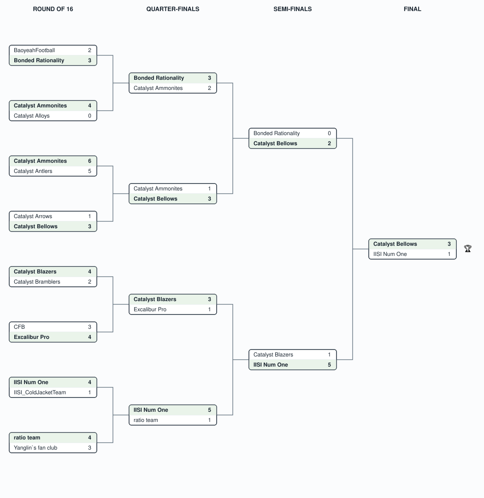

# Agentic Football — GCR Virtual 2026

## Event Details

- **Event**: AWS AI League — Agentic Football, GCR Virtual (Greater China Region)
- **Date**: September 2026
- **Format**: 16-team single-elimination knockout — Round of 16 → Quarter-finals → Semi-finals → Final
- **Game**: Agentic Football — build a team of AI agents that compete in live matches; head-to-head elimination rather than a scored map run.

## Bracket

Single-elimination: the winner of each match (shaded, in bold) advances to the round on its right. Full per-round scores are in the tables below.

## Results

### Round of 16

| Match | Home | Score | Away | Winner |
|-------|------|-------|------|--------|
| 1 | BaoyeahFootball | 2-3 | Bonded Rationality | **Bonded Rationality** |
| 2 | CataIyst Ammonites | 4-0 | Catalyst Alloys | **CataIyst Ammonites** |
| 3 | Catalyst Ammonites | 6-5 | Catalyst Antlers | **Catalyst Ammonites** |
| 4 | Catalyst Arrows | 1-3 | Catalyst Bellows | **Catalyst Bellows** |
| 5 | Catalyst Blazers | 4-2 | Catalyst Bramblers | **Catalyst Blazers** |
| 6 | CFB | 3-4 | Excalibur Pro | **Excalibur Pro** |
| 7 | IISI Num One | 4-1 | IISI_ColdJacketTeam | **IISI Num One** |
| 8 | ratio team | 4-3 | Yanglin`s fan club | **ratio team** |

### Quarter-finals

| Match | Home | Score | Away | Winner |
|-------|------|-------|------|--------|
| 1 | Bonded Rationality | 3-2 | CataIyst Ammonites | **Bonded Rationality** |
| 2 | Catalyst Ammonites | 1-3 | Catalyst Bellows | **Catalyst Bellows** |
| 3 | Catalyst Blazers | 3-1 | Excalibur Pro | **Catalyst Blazers** |
| 4 | IISI Num One | 5-1 | ratio team | **IISI Num One** |

### Semi-finals

| Match | Home | Score | Away | Winner |
|-------|------|-------|------|--------|
| 1 | Bonded Rationality | 0-2 | Catalyst Bellows | **Catalyst Bellows** |
| 2 | Catalyst Blazers | 1-5 | IISI Num One | **IISI Num One** |

### Final

| Home | Score | Away | Winner |
|------|-------|------|--------|
| Catalyst Bellows | 3-1 | IISI Num One | 🏆 **Catalyst Bellows** |

**Champion: Catalyst Bellows** — unbeaten through four rounds, closing out a 2-0 semi-final over Bonded Rationality before beating IISI Num One 3-1 in the final.

### A note on the team names

Two near-identical names appear in the bracket and are **different teams**: **CataIyst Ammonites** (spelled with a capital "I") and **Catalyst Ammonites** (lower-case "l"). Both reached the quarter-finals on opposite sides of the draw — CataIyst Ammonites via a 4-0 win over Catalyst Alloys, and Catalyst Ammonites via a 6-5 win over Catalyst Antlers — and both were knocked out in the quarters. The names are preserved exactly as entered.
