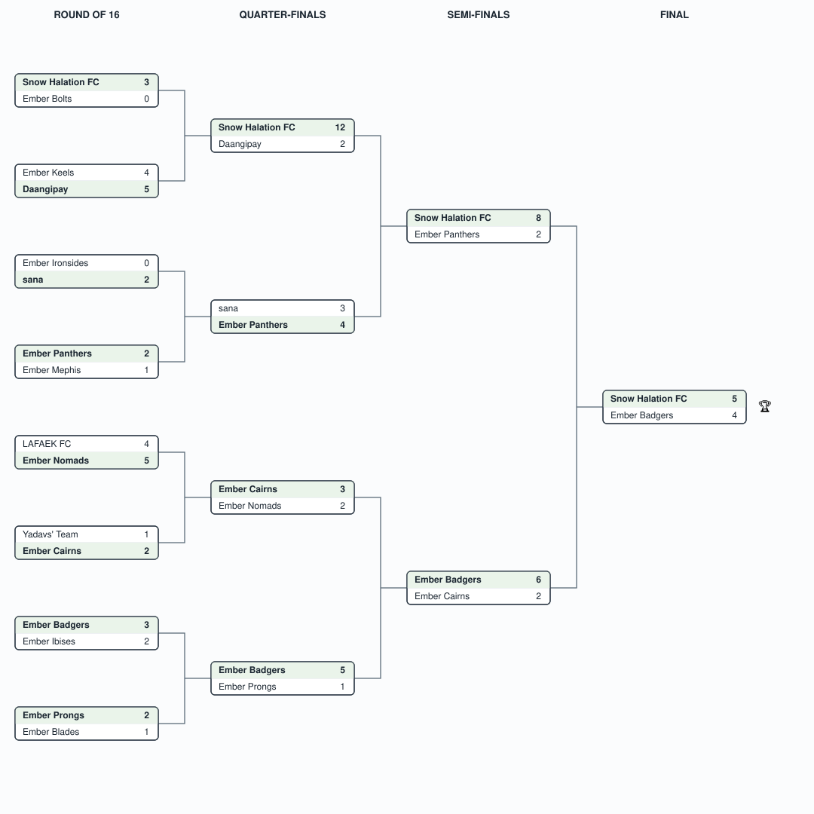

# Agentic Football — Virtual APJ 2026

## Event Details

- **Event**: AWS AI League — Agentic Football, Virtual APJ (Asia Pacific & Japan)
- **Date**: September 2026
- **Format**: 16-team single-elimination knockout — Round of 16 → Quarter-finals → Semi-finals → Final
- **Game**: Agentic Football — build a team of AI agents that compete in live matches; unlike the Agentic Maze events, this is head-to-head elimination rather than a scored map run.

## Bracket

Single-elimination: the winner of each match (shaded, in bold) advances to the round on its right. Full per-round scores are in the tables below.

## Results

### Round of 16

| Match | Home | Score | Away | Winner |
|-------|------|-------|------|--------|
| 1 | Snow Halation FC | 3-0 | Ember Bolts | **Snow Halation FC** |
| 2 | Ember Keels | 4-5 | Daangipay | **Daangipay** |
| 3 | Ember Ironsides | 0-2 | sana | **sana** |
| 4 | Ember Panthers | 2-1 | Ember Mephis | **Ember Panthers** |
| 5 | LAFAEK FC | 4-5 | Ember Nomads | **Ember Nomads** |
| 6 | Yadavs' Team | 1-2 | Ember Cairns | **Ember Cairns** |
| 7 | Ember Badgers | 3-2 | Ember Ibises | **Ember Badgers** |
| 8 | Ember Prongs | 2-1 | Ember Blades | **Ember Prongs** |

### Quarter-finals

| Match | Home | Score | Away | Winner |
|-------|------|-------|------|--------|
| 1 | Snow Halation FC | 12-2 | Daangipay | **Snow Halation FC** |
| 2 | Ember Panthers | 4-3 | sana | **Ember Panthers** |
| 3 | Ember Cairns | 3-2 | Ember Nomads | **Ember Cairns** |
| 4 | Ember Badgers | 5-1 | Ember Prongs | **Ember Badgers** |

### Semi-finals

| Match | Home | Score | Away | Winner |
|-------|------|-------|------|--------|
| 1 | Snow Halation FC | 8-2 | Ember Panthers | **Snow Halation FC** |
| 2 | Ember Badgers | 6-2 | Ember Cairns | **Ember Badgers** |

### Final

| Home | Score | Away | Winner |
|------|-------|------|--------|
| Snow Halation FC | 5-4 | Ember Badgers | 🏆 **Snow Halation FC** |

**Champion: Snow Halation FC** — unbeaten through four rounds, capped by a dominant 12-2 quarter-final and a tight 5-4 win over Ember Badgers in the final.
