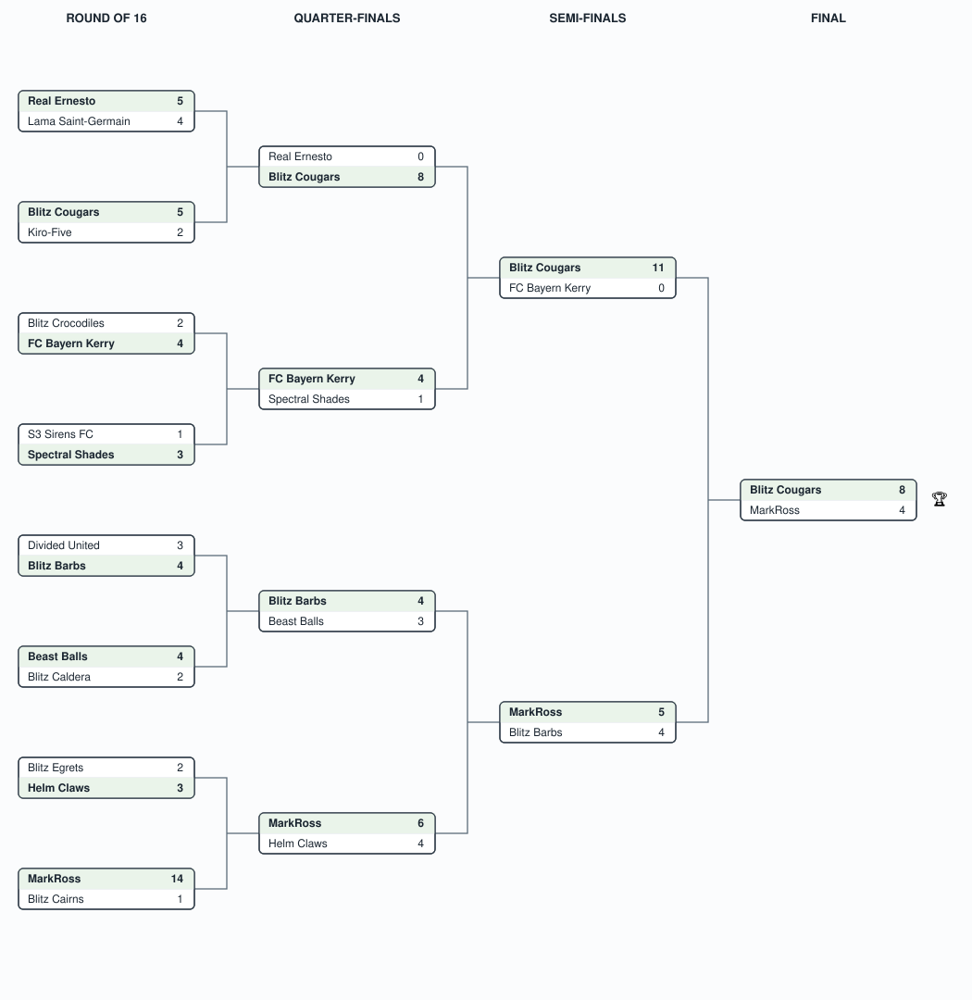

# Agentic Football — Virtual EMEA 2026

## Event Details

- **Event**: AWS AI League — Agentic Football, Virtual EMEA (Europe, Middle East & Africa)
- **Date**: September 2026
- **Format**: 16-team single-elimination knockout — Round of 16 → Quarter-finals → Semi-finals → Final
- **Game**: Agentic Football — build a team of AI agents that compete in live matches; head-to-head elimination rather than a scored map run.

## Bracket

Single-elimination: the winner of each match (shaded, in bold) advances to the round on its right. Full per-round scores are in the tables below.

## Results

### Round of 16

| Match | Home | Score | Away | Winner |
|-------|------|-------|------|--------|
| 1 | Real Ernesto | 5-4 | Lama Saint-Germain | **Real Ernesto** |
| 2 | Blitz Cougars | 5-2 | Kiro-Five | **Blitz Cougars** |
| 3 | Blitz Crocodiles | 2-4 | FC Bayern Kerry | **FC Bayern Kerry** |
| 4 | S3 Sirens FC | 1-3 | Spectral Shades | **Spectral Shades** |
| 5 | Divided United | 3-4 | Blitz Barbs | **Blitz Barbs** |
| 6 | Beast Balls | 4-2 | Blitz Caldera | **Beast Balls** |
| 7 | Blitz Egrets | 2-3 | Helm Claws | **Helm Claws** |
| 8 | MarkRoss | 14-1 | Blitz Cairns | **MarkRoss** |

### Quarter-finals

| Match | Home | Score | Away | Winner |
|-------|------|-------|------|--------|
| 1 | Real Ernesto | 0-8 | Blitz Cougars | **Blitz Cougars** |
| 2 | FC Bayern Kerry | 4-1 | Spectral Shades | **FC Bayern Kerry** |
| 3 | Blitz Barbs | 4-3 | Beast Balls | **Blitz Barbs** |
| 4 | MarkRoss | 6-4 | Helm Claws | **MarkRoss** |

### Semi-finals

| Match | Home | Score | Away | Winner |
|-------|------|-------|------|--------|
| 1 | Blitz Cougars | 11-0 | FC Bayern Kerry | **Blitz Cougars** |
| 2 | MarkRoss | 5-4 | Blitz Barbs | **MarkRoss** |

### Final

| Home | Score | Away | Winner |
|------|-------|------|--------|
| Blitz Cougars | 8-4 | MarkRoss | 🏆 **Blitz Cougars** |

**Champion: Blitz Cougars** — dominant throughout, including an 8-0 quarter-final and an 11-0 semi-final, before beating MarkRoss 8-4 in the final.

### A note on the final

The final was played under a known bug. Blitz Cougars lined up in a **1-1-1-1 formation**, and due to the bug MarkRoss was **forced to mirror the same 1-1-1-1 formation** despite having selected a different one — leaving several MarkRoss players out of position for the entire match. AWS were made aware of the bug immediately at kickoff but chose to proceed with the match as played. The result stands as recorded above.
